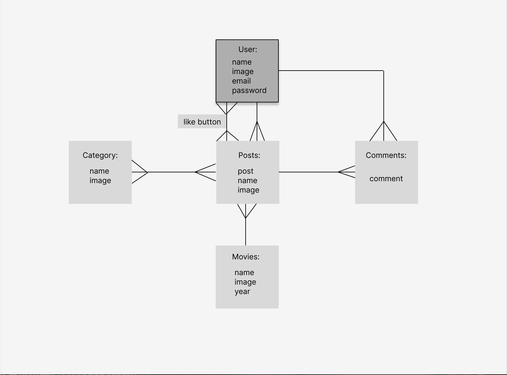

# Almonds Movie Discussion Boards

Almonds is my second individual project after 5 weeks studying at General Assembly for Software Engineering Immersive Course. We were required to use Ruby to create a CRUD system with at least 3 models. 5 models were included in Almonds.

## Author: 
Wen Gong

## Link:
https://moviewen.herokuapp.com/

## Login Details
Email: 123@gmail.com
Password: chicken

## Object Model Associations

## Tech used: 
* Ruby on Rails 
* HTML 
* jQuery
* CSS
* javascript

## Wish List
* search bar
* follower and following
* link to Spotify
