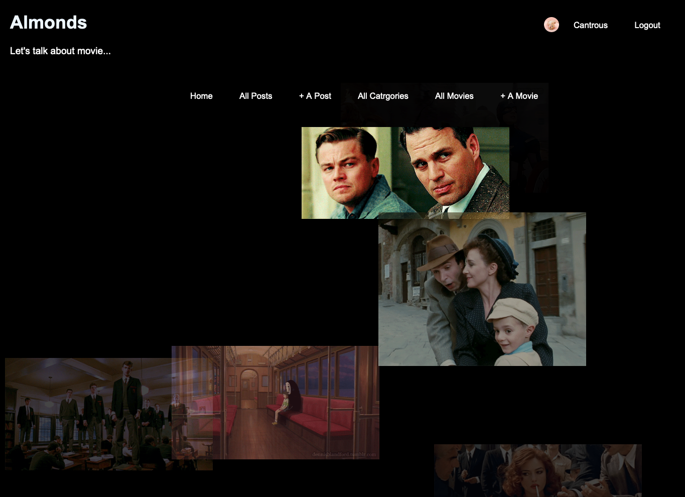

# Almonds Movie Discussion Boards

I created this web application for my second individual project for General Assembly Software Engineering Immersive Course. We were tasked to create a CRUD system using everything we had learnt in the last 5 weeks about front and back end web development. We were given about a week to create a functioning application complete with Models (at least 3), Views, Controllers, Gems and site deployment (Heroku).
This website is for people to discuss movies and share their thoughts about movies.

## Author: 
Wen Gong

## Link:
https://moviewen.herokuapp.com/

## Login Details
Email: 123@gmail.com
Password: chicken

## Object Model Associations

## Tech used: 
* Ruby on Rails 
* HTML 
* jQuery
* CSS
* javascript

## Wish List
* search bar
* follower and following
* link to Spotify
